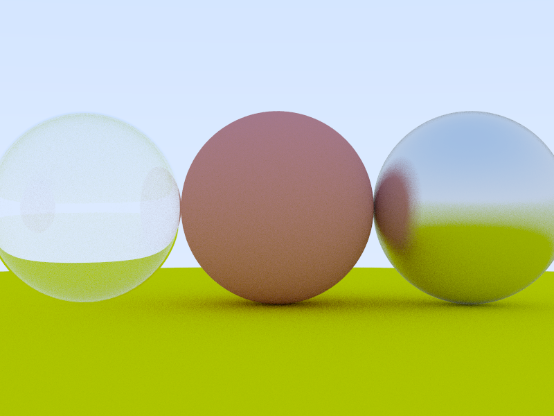

# rust_soft_render
A soft render base on Ray Tracing in one weekend and Games101.

Include a simple BMP img encode; some simple tests.

Just for learning Rust.

😊

I also add mult thread function, which is much more easier for me then doing this with c++.

The final result is like this:
